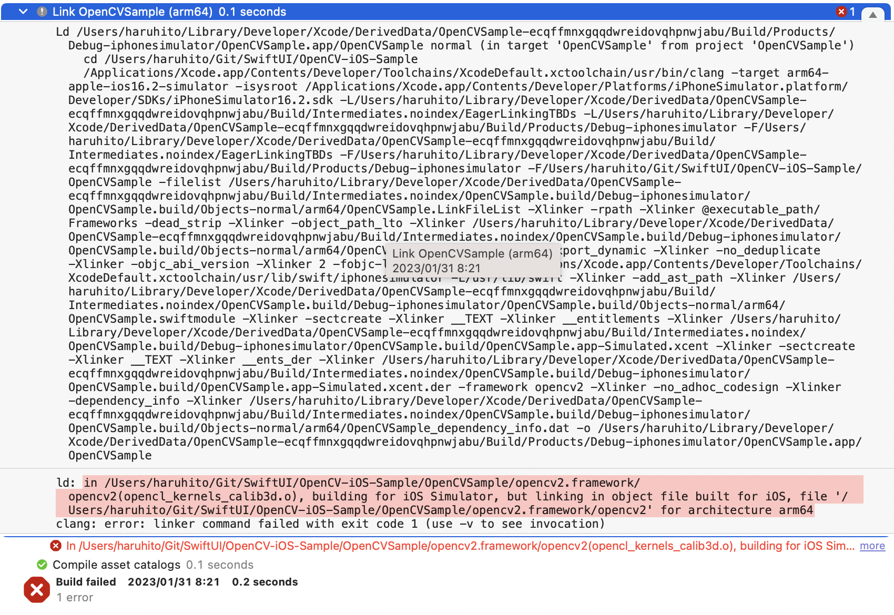
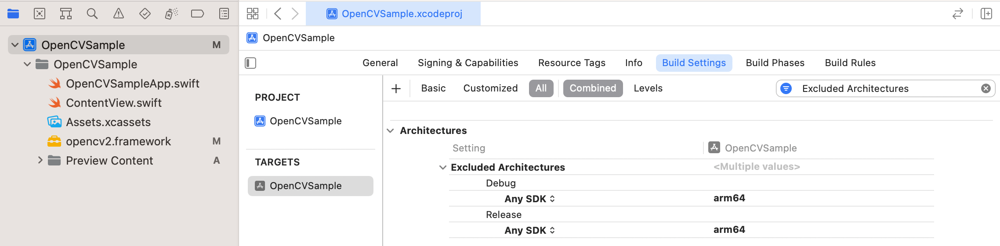

# OpenCV-iOS-Sample
iOS向けOpenCVを取り込んだサンプルプロジェクト  

OpenCVのフレームワークはファイルサイズが大きいため各自でダウンロードをお願いします。  
[OpenCV 4.7.0](https://github.com/opencv/opencv/releases/tag/4.7.0)を利用しています。  
opencv-4.7.0-ios-framework.zipをダウンロードして `opencv2.framework` フォルダーごと `OpenCVSample` フォルダー内に上書きコピーしてください。  

# OpenCVライブラリー取り込み時のポイント
## opencv2.framework/opencv2(opencl_kernels_calib3d.o), building for iOS Simulator, but linking in object file built for iOS, file 'opencv2.framework/opencv2' for architecture arm64 エラーが発生する

[こちらの参考サイト](https://qiita.com/littleossa/items/ff75b19e0ac6713941f8)によると  
```
arm64 アーキテクチャのサポートとXcode12互換バージョンは、
多くの一般的なサードパーティライブラリ（Firebase、AFNetworkingなど）では
まだ提供されていません
```
とのことです。  
プロジェクトの `Build Settings` の項目 `Excluded Architectures` の `Debug` と `Release` に `arm64` を追加することで `arm64` を除外するといいそうです。  



# 参考サイト
- [OpenCVのセットアップ方法（iOSアプリ用）](https://www.techgaku.com/setup-opencv-for-ios-apps/)  
- [M1 Mac & Xcodeで「building for iOS Simulator, but linking in object file ... for architecture arm64」エラーの対処法](https://qiita.com/littleossa/items/ff75b19e0ac6713941f8)  
- [ぱくたそ](https://www.pakutaso.com/)  
サンプル写真で利用しました
